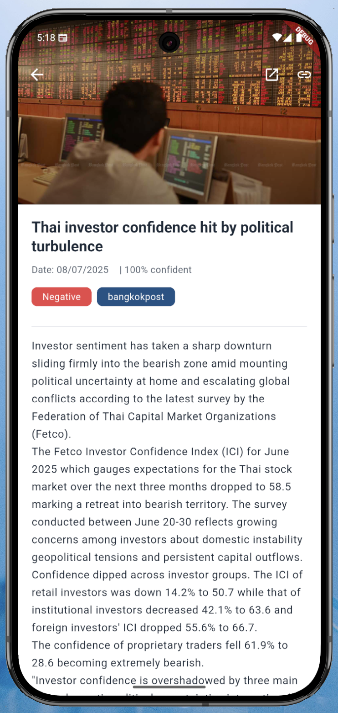

# 📈 TradeMine

**TradeMine** เป็นแอปพลิเคชันสำหรับติดตามและวิเคราะห์หุ้น  
มาพร้อมฟีเจอร์ที่ช่วยให้นักลงทุนใช้งานได้ง่ายและสะดวกขึ้น

---

## ✨ ฟีเจอร์เด่น

- 🔮 **คาดการณ์ราคาหุ้นล่วงหน้า** ของวันถัดไป
- 📰 **ข่าวประจำวัน** ด้านเศรษฐกิจและการลงทุน
- 📊 **กราฟหุ้นรายตัว** สำหรับวิเคราะห์แนวโน้ม
- 📌 มีหุ้นให้เลือกดูแล้ว **หุ้นไทย 10 ตัว** และ **หุ้นอเมริกา 10 ตัว**

---

## 🚧 สถานะโปรเจกต์

แอปพลิเคชันกำลังอยู่ในขั้น **พัฒนา (Development)**

---

## 📷 ตัวอย่างหน้าจอแอป

### 🏠 หน้าหลัก (HomePage)

### 📊 หน้าข้อมูลหุ้นรายตัว (Stock Detail)

### 📰 หน้าข่าว (News Page)

### 📝 หน้ารายละเอียดข่าว (News Detail)

### 💼 หน้าพอร์ตทดลอง (Demo Portfolio)

### 🔔 หน้าแจ้งเตือน (Notification)

### 🔎 หน้าค้นหาหุ้น (Search)

---

## 🛠 เทคโนโลยีที่ใช้

- Flutter (Mobile Development)
